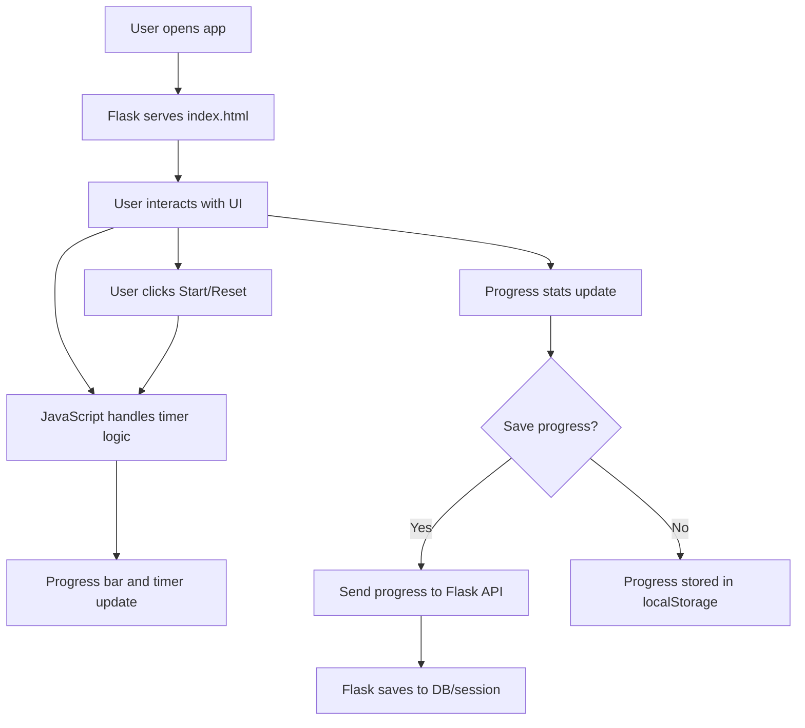
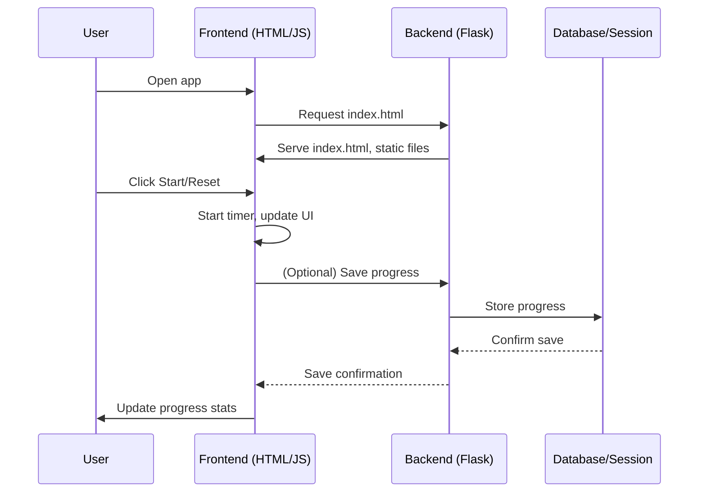

# Pomodoro Timer Web Application Architecture Proposal

## Overview
This document outlines the proposed architecture for a Pomodoro timer web application, based on the requirements and UI mock provided. The application will be built using Flask (Python) for the backend and HTML/CSS/JavaScript for the frontend.



---

## 1. Frontend
- **HTML**: Semantic structure for UI components:
  - Header ("Pomodoro Timer")
  - Timer display (circular progress bar, time left, status)
  - Start/Reset buttons
  - Progress section (sessions completed, focus time)
- **CSS**: Modern, clean design using flexbox/grid, gradients, and rounded corners. Responsive for desktop/mobile.
- **JavaScript**:
  - Timer logic and countdown
  - Progress bar animation
  - Button event handling
  - Progress stats update
  - Use localStorage for session persistence

## 2. Backend (Flask)
- **Flask App**: Serves HTML templates and static files (CSS/JS)
- **API Endpoints**:
  - `/`: Main page (renders timer UI)
  - `/progress`: (GET/POST) For saving/loading user progress (optional, for server-side persistence)
- **Session Management**: Use Flask sessions or a database (e.g., SQLite) for user progress if cross-device support is needed



## 3. File Structure
```
/project-root
│
├── app.py                # Flask app entry point
├── templates/
│   └── index.html        # Main UI template
├── static/
│   ├── css/
│   │   └── style.css     # Stylesheet
│   └── js/
│       └── timer.js      # Timer logic
├── tests/                # Unit and integration tests
│   └── test_timer.py     # Sample backend test
├── architecture.md       # Architecture proposal (this file)
└── README.md
```

## 4. Component Responsibilities
- **Flask (`app.py`)**: Routing, session management, API for progress
- **HTML (`index.html`)**: UI structure, links to CSS/JS
- **CSS (`style.css`)**: Visual design, responsive layout
- **JavaScript (`timer.js`)**: Timer countdown, progress bar animation, button event handling, local/session storage

## 5. Testability Improvements
- Separate timer/session logic into Python modules/classes for isolated unit testing
- Structure JavaScript into functions/modules for easier testing
- RESTful API endpoints for progress/session management
- Add a `tests/` directory and use `pytest` for backend tests
- Use configuration files or environment variables for settings
- Design backend logic for easy mocking/dependency injection
- Organize static files for clarity and easier testing
- Define clear data models if persistent storage is needed
- Implement error handling in API endpoints and JS functions
- Document API endpoints and core logic

## 6. Optional Enhancements
- User authentication for personalized progress tracking
- Advanced analytics/dashboard for productivity
- Internationalization/localization support

---

**This architecture is designed for maintainability, scalability, and ease of testing.**
